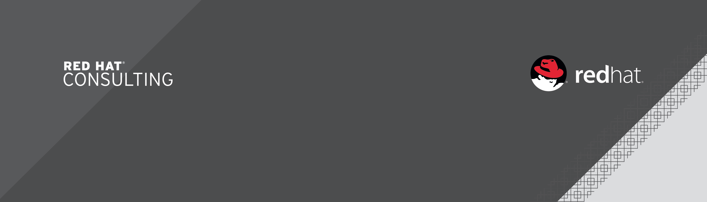

= {subject}
:subject: Enterprise Alerting with Red Hat JBoss Fuse and OpenShift 3
:description: Enterprise Alerting with Red Hat JBoss Fuse and OpenShift 3
:doctype: book
:author: Toufic Arabi & Bryan Saunders
:confidentiality: Confidential
:customer:  Red Hat
:listing-caption: Listing
:toc:
:toclevels: 6A
:sectnums:
:chapter-label:
:icons: font
ifdef::backend-pdf[]
:pdf-page-size: A4
:title-page-background-image: 
:pygments-style: tango
:source-highlighter: coderay
endif::[]

= General Information

The following table shows a high level summary of the objectives of this Red Hat Summit presentation.

[cols="2*"",options=header]
|===
|Col Name
|Col Name

|Session Title
|Enterprise Alerting with Red Hat JBoss Fuse & OpenShift V3

|Type
|Slide Presentation

|Proposed Track
|Application and Platform Infrastructure

|Topic(s)
|Application Development & Integration, PaaS

|Theme(s)
|Cloud, BPM and Integration

|Solution(s)
|Middleware

|Product(s)
|Fuse, BPMS & OSE v3

|Service(s)
|Consulting

|Target Audiences
|Architect, Developer, IT Executive, IT Manager

|Benefit(s)
|Timeness, Flexibility, Interoperability, Performance, Portability, Reliability, Scalability, Simplicity

|Key Audience Takeaway
|Fill in the blanks

|Proposed Speaker(s)
|Bryan Saunders (Presenter),Toufic Arabi (Co-Presenter)

|===

<<<

= Session Abstract

The need for realtime notifications and information exchange has continuously increased in the past decade. Whether it is last breaking news, or shipment notifications,
us humans have an incline to want to know the latest around us and maintain control of our daily activities. The world is so interconnected nowadays, that a small event
at one end of the world has quite the ripple effect across the globe. Such events could be good or bad: a Tsunami on one end of the world, or the Red Sox winning the World Series
on the other end, yet both deserve notifications being issued for them and sent to subscribers.

Imagine that notifications could be modeled into business processes where a change in the business nature can be automatically updated in enterprise scale applications. Furthermore,
imagine that notifications could be sent to legacy and non legacy system through proper modeling of enterprise messaging routes with high availability and reliability. Finally, imagine
this infrastructure sitting in an Open-Hybrid cloud infrastructure.

This session focuses on how the infrastructure above was built using Red Hat's OpenShift V3, JBoss Fuse and JBoss BPMS. We will be showing how OpenShift V3
docker containers containing JBoss BPMS processes and JBoss Fuse Camel routes were packaged and deployed into the cloud, and how enterprise alerting can flow from a business
process to an enterprise route to be finally delivered in text message format to a subscriber.
